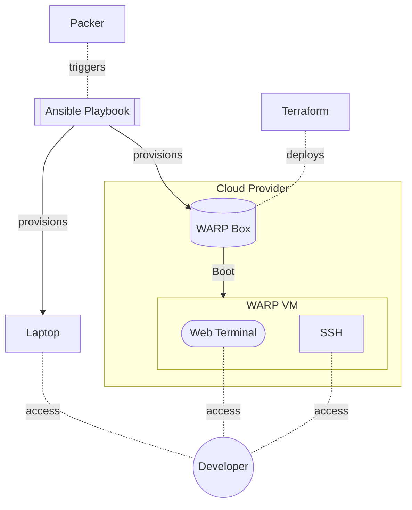

# WARP
[](https://github.com/mrzzy/warp/actions/workflows/box.yaml)

Code anywhere with an internet connection.

## Introduction
WARP is portable, console based development environment which grew out the need to have a fully featured development environment ready to go, in the absence of my Physical Laptop.  It is a full recreation of my Linux-based development environment in a Cloud VM, accessible via SSH or a Web Browsers.

> See [design](#Design) for architecture deep dive.

## Features
- **Portable** WARP is accessible from on any machine with a Web Browser or SSH client over the internet.
- **Consistency** Each WARP instance has identical OS, packages & development tooling versions, ensuring the reproducibility of software written on it.
- **Cloud Native** Designed to run in the cloud, WARP attains the ability to vertically scale based on development workload.
- **Lightweight** Console-based by design, WARP avoids the overhead of a running a full blown Desktop environment.

## Usage
1. Install the Pypi modules listed in `requirements.txt`
```sh
pip install -r requirements.txt
```
2. Install pre-commit hooks:
```sh
pre-commit install
```
### Local
3. Recreate WARP's development environment locally:
```
make apply
```

### GCP
3. Install Packer, Terraform
4. Edit `project_id` & `zone` in `sources.pkr.hcl`
```hcl
  # google cloud build environment
  project_id  = "<GCP_PROJECT_ID>"
  zone        = "<ZONE>"
```
5. Build WARP Box as a GCE VM image
```sh
make box-gcp
```
6. Spin up WARP VM can on Google Cloud with included Terraform module:
```hcl
module "warp_vm" {
  source = "github.com/mrzzy/warp//deploy/terraform/gcp_vm"
  # GCE metadata tags
  tags = [ <TAGS...> ]
  # secure web terminal with TLS
  web_tls_cert   = "<FULL CHAIN TLS CERT>"
  web_tls_key    = "<TLS PRIVATE KEY>"
  # ssh key authentication
  ssh_public_key = "<SSH PUBLIC KEY>"
}
```

## Design


1. Packer triggers a build of the development environment VM image, known as WARP Box, on a Cloud Provider (currently Google Cloud).
2. An Ansible Playbook provisions WARP Box, installing packages & setting up tools.
    - Ansible Playbook's idempotence lends itself well to provisioning physical hardware (eg. my Laptop).
    - Being the single source of truth, Ansible ensures a consistent the development environment between WARP VM & physical hardware.
3. The Terraform module spins up WARP VM: a Cloud VM using WARP Box as a boot disk on the Cloud Provider.
4. The developer is able given ample options to access the development environment: WARP VM's Web Terminal or SSH interfaces, or when available, a physical laptop.

## License
MIT.
